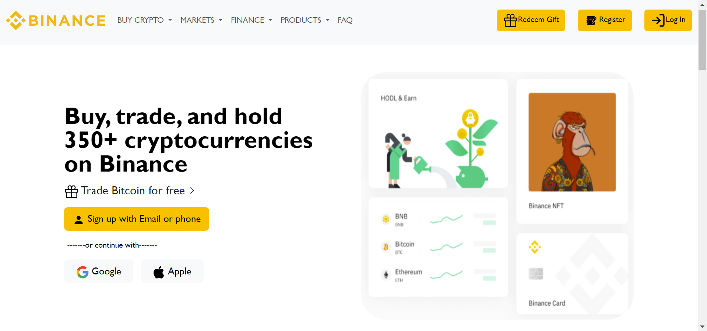

# BINANCE-A Frontend Replica:
BINANCE is a leading cryptocurrency exchange platform that offers a wide range of services and products for traders and investors. Whether you want to buy,
sell,trade, or store your digital assets, BINANCE has the tools and features you need to succeed in the crypto market. With BINANCE, you can access over 300 
cryptocurrencies, including Bitcoin, Ethereum, Binance Coin, and many more.
        
# Built with:
- HTML5
- CSS3
- BootStrap

# Guide to use the project: 
- Download Bootstrap 5 from getbootstrap.com and copied the JS and CSS files to HTML directory.
- Link the Bootstrap CSS file and added core Bootstrap JavaScript to HTML file using the <link> and <script> tags.
- Use the Bootstrap grid system to create a responsive layout for website with rows and columns.
- Add a navigation bar, a jumbotron, a footer and some content to my website using Bootstrap components and custom CSS.
- Test the website on different devices and browsers to ensure it looked good and worked well.

# Things I've mastered with this project:
- Advanced responsive design concepts (responsive images).
- Writing globally used CSS mixins with breakpoints for media queries.
- Browser support concepts

 # Preview of Website:
 
